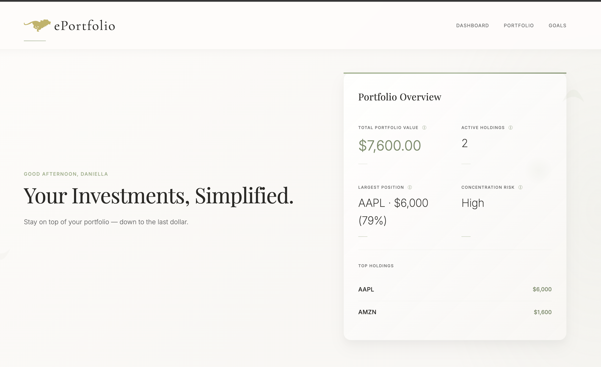
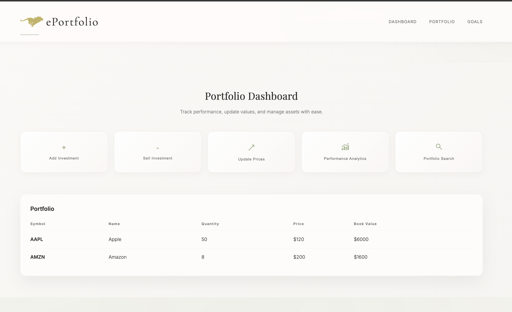
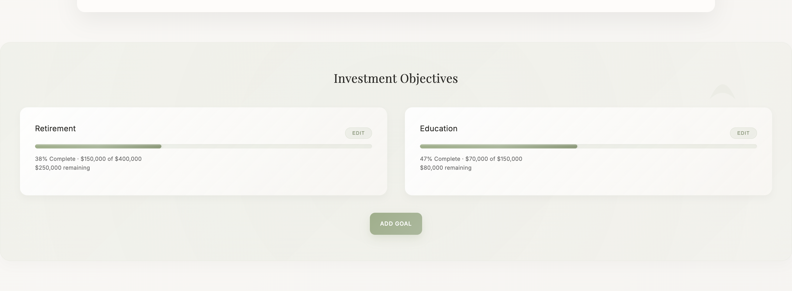
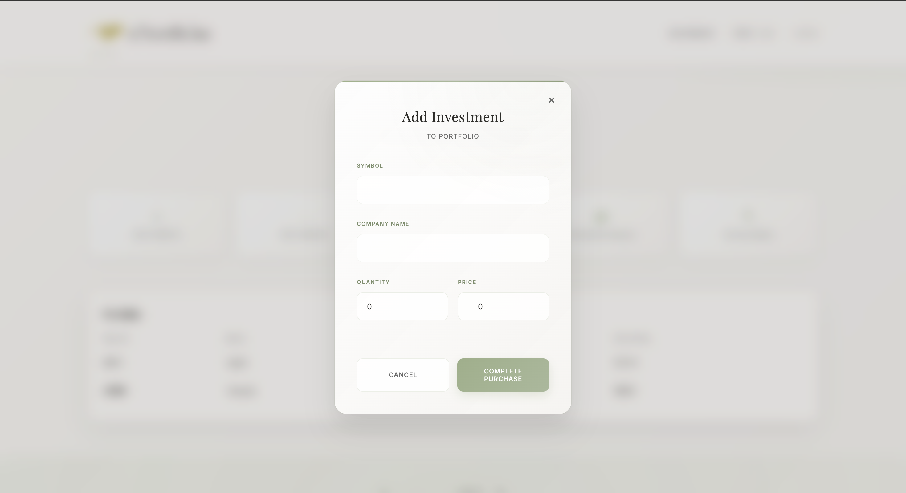

# ePortfolio 💰

ePortfolio is an investment management web application that allows users to manage a portfolio of stocks and mutual funds. Users can buy and sell investments, update prices, calculate gains, and search their portfolio through a web-based interface connected to a Spring Boot REST API.

This project was originally developed as a Java Swing application for a university assignment and later rebuilt as a full-stack web application to improve usability and extend functionality.

## Live Demo

- Frontend (Netlify):  
  https://eportfolio-2.netlify.app/

- Backend API (Render):  
  https://eportfolio-3b6q.onrender.com/

The frontend communicates directly with the deployed backend API.

## Features

- Buy and sell stock and mutual fund investments  
- Update prices and recalculate portfolio gains  
- View total and individual investment gains  
- Search investments by symbol, name, or price range  
- Modal-based UI actions with confirmation feedback  

## Tech Stack

Frontend:
- HTML
- CSS
- JavaScript
- Svelte
- Vite

Backend:
- Java
- Spring Boot
- Maven

## Screenshots

## Running the Project Locally

This project consists of a Spring Boot backend and a Svelte (Vite) frontend. During local development, they are run as two separate applications.

### Prerequisites

Make sure the following tools are installed:

Java JDK 17  
java -version  
javac -version  

Maven  
mvn -v  

Node.js (v18 or later)  
node -v  
npm -v  

If needed, missing tools can be installed using Homebrew:
brew install openjdk@17 maven node

---

### Backend Setup (Spring Boot)

1. Navigate to the backend directory  
cd backend/eportfolio  

This directory should contain:
- pom.xml  
- src/  
- Dockerfile  

2. Run the backend  
mvn spring-boot:run  

If successful, the backend will start on port 8080.

3. Verify the backend is running  

Open a browser and visit:  
http://localhost:8080/api/portfolio  

A JSON response indicates the backend is running correctly.

---

### Frontend Setup (Svelte + Vite)

1. Navigate to the frontend directory  
cd frontend/eportfolio-ui  

2. Install dependencies (only required once)  
npm install  

3. Start the development server  
npm run dev  

Vite will start the frontend at:  
http://localhost:5173  

---

### Running Both Applications

Use two terminal windows:

Terminal 1 – Backend  
cd backend/eportfolio  
mvn spring-boot:run  

Terminal 2 – Frontend  
cd frontend/eportfolio-ui  
npm run dev  

The frontend communicates with the backend at:  
http://localhost:8080  

## Notes

- The application supports stock and mutual fund investments.  
- Transactions follow the validation rules and fee structure defined in the original assignment.

## Background

This project was originally developed for CIS*2430 (Object-Oriented Programming) at the University of Guelph and later expanded independently as a full-stack web application.

## Author

Daniella Toth  
Software Engineering student, University of Guelph
